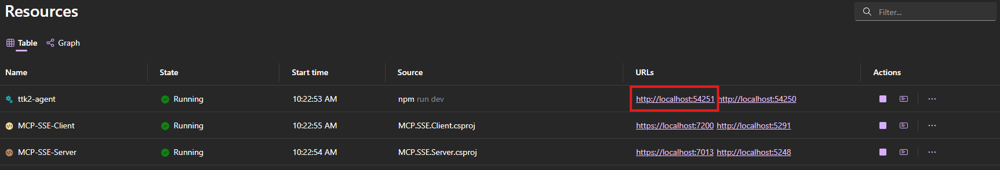

# MCP Server Sample

This project demonstrates a Model Context Protocol (MCP) server and client implementation in .NET for managing employee vacation days. It provides a backend service for tracking, querying, and updating vacation balances for employees, and exposes these capabilities through MCP tools.

## Components

- The **SSE** folder includes a client-server implementation of the Model Context Protocol (MCP) using the HTTP Streaming / SEE transport layer. The solution in based on .NET Aspire and it includes a server (based on ASP.NET Core) and a client (a web application built with Blazor and Semantic Kernel).
- The **Stdio** folder includes a client-server implementation of the Model Context Protocol (MCP) using the standard input/output transport layer. The server is implemented in a console application.

## Documentation
The sample is documented through a series of blog posts:

- [Using Model Context Protocol in agents - Introduction](https://www.developerscantina.com/p/mcp-intro/)
- [Using Model Context Protocol in agents - Copilot Studio](https://www.developerscantina.com/p/mcp-copilot-studio/)
- [Using Model Context Protocol in agents - Pro-code agents with Semantic Kernel](https://www.developerscantina.com/p/mcp-semantic-kernel/)

## Getting Started

The repository contains two versions of the same samples: one built with C# and .NET and one with TypeScript.

To run the .NET sample, you need to have the following prerequisites installed:

- [.NET SDK 9.0](https://dotnet.microsoft.com/download)

To run the TypeScript sample, you need to have the following prerequisites installed:

- [Node.js](https://nodejs.org/en/download/)

For both languages, you need to have the following prerequisites installed:

- [Visual Studio Code](https://code.visualstudio.com/)
- [The Azurite extension for Visual Studio Code](https://marketplace.visualstudio.com/items?itemName=Azurite.azurite)

## Running the stdio sample

### Run the .NET sample

1) Start the Azurite Table service emulator by clicking on the button in the application bar, or by opening the command palette (**Ctrl+Shift+P**) and selecting **Azurite: Start Table Service**.
2) You can connect any client application (Visual Studio Code, AI Toolkit, a custom application) by using the following configuration:
  - Command: `dotnet`
  - Arguments: `run --project src/csharp/Stdio/MCP.Stdio.Server/MCP.Stdio.Server.csproj`

### Run the TypeScript sample

1) Start the Azurite Table service emulator by clicking on the button in the application bar, or by opening the command palette (**Ctrl+Shift+P**) and selecting **Azurite: Start Table Service**.
2) You can connect any client application (Visual Studio Code, AI Toolkit, a custom application) by using the following configuration:
  - Command: `node`
  - Arguments: `/src/ts/stdio/server/dist/app.js`

Before using it, make sure to compile the TypeScript code by running the following command:

```bash
cd src/ts/stdio/server
npm run build
```

## Running the SSE sample

To run the SSE sample, follow these steps:

- Clone the repository to your local machine.
- Open the `appsettings.json` file in the `MCP.SSE.AppHost` project inside the `SSE` folder and update the `openAiConnectionName` property with your Azure OpenAI connection string using the following format:
  
    ```json
    "openAiConnectionName": "Endpoint=https://<your-endpoint>.openai.azure.com/;Key=<your-key>"
    ```
- Start the Azurite Table service emulator by clicking on the button in the application bar, or by opening the command palette (**Ctrl+Shift+P**) and selecting **Azurite: Start Table Service**.
- Run the `MCP.SSE.AppHost` project using the following command:

    ```bash
    dotnet run --project MCP.SSE.AppHost/MCP.SSE.AppHost.csproj
    ```
- Once the project starts, a new browser window will automatically open up on the Aspire dashboard.
- Open a new browser tab and navigate to the following URL:

    ```plaintext
    http://localhost:5291/
    ```
- Now you can use the Blazor application to send prompts to the LLM. You can use one of the following prompts to trigger the usage of one of the MCP tools:

    ```plaintext
    "Give me a list of the employees and their vacation days left"
    "Charge 5 vacation days to Alice Johnson""
    ```

## Running the Teams AI library sample
    
The Teams AI library sample is already registered as part of the Aspire solution. However, before using it, you must follow these steps:

- Open the **ttk2-agent** project in the **SSE** folder
- Rename the .`env.example` file to `.env`
- Open the file and update the variables with the correct values for your Azure OpenAI service:
  - `AZURE_OPENAI_API_KEY` with the key of your Azure OpenAI service
  - `AZURE_OPENAI_ENDPOINT` with the endpoint of your Azure OpenAI service
  - `AZURE_OPENAI_API_VERSION` with the API version (pay attention, this is a different value than the model version, you can find it in the Azure OpenAI portal)
  - `AZURE_OPENAI_MODEL_DEPLOYMENT_NAME` with the name of your model deployment in Azure OpenAI
  
Once the Aspire dashboard is up & running, you will see that the **ttk2-agent **project has two endpoints:



You can access to the testing tool for the agent by using the endpoint with the higher port number and adding the `/devtools` path to it.
For example, in the previous image, the URL would be:

```plaintext
http://localhost:54251/devtools/
```
